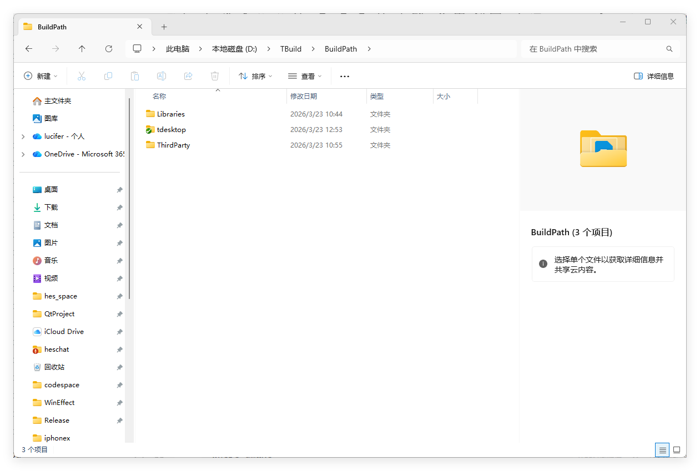
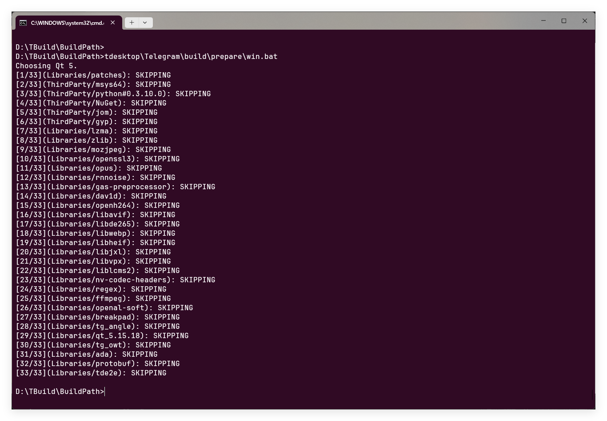
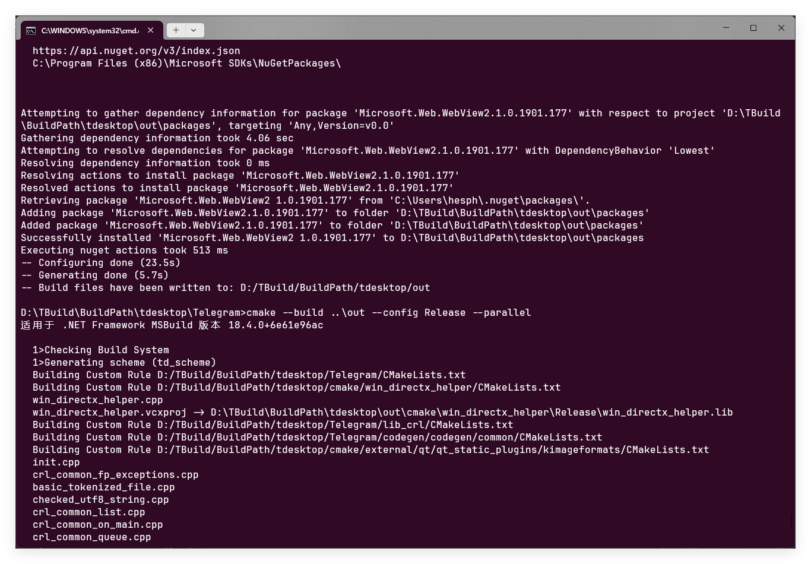
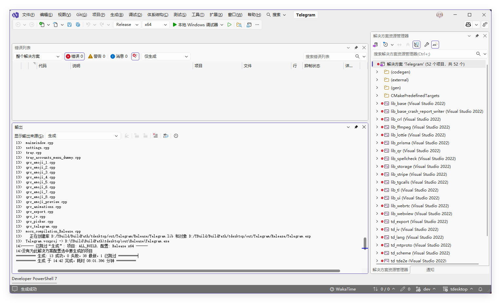

# 编译前准备
```
Python 3.10
Git
```
创建以下文件夹

```
D:\TBuild\BuildPath
D:\TBuild\BuildPath\Libraries
D:\TBuild\BuildPath\ThirdParty
```

开一个新的cmd窗口运行如下指令
注:此处path修改为自己的path,我使用的是Enterprise版本

```bash
%comspec% /k "C:\Program Files\Microsoft Visual Studio\18\Enterprise\VC\Auxiliary\Build\vcvars64.bat" -vcvars_ver=14.44

cd /d D:\TBuild\BuildPath
```

# 克隆源代码
在BuildPath目录下运行如下指令:

```bash
git clone --recursive https://github.com/telegramdesktop/tdesktop.git
tdesktop\Telegram\build\prepare\win.bat
```

# 构建
在**BuildPath_\tdesktop\Telegram**下运行如下指令

注: 由于我本地有多个qt环境 所以我加了QT_VERSION_MAJOR

```bash
configure.bat x64 force -DQT_VERSION_MAJOR=5 -DTDESKTOP_API_ID=17349 -DTDESKTOP_API_HASH=344583e45741c457fe1862106095a5eb -DDESKTOP_APP_USE_PACKAGED=OFF -DDESKTOP_APP_DISABLE_CRASH_REPORTS=OFF
```


```bash
where qmake
qmake-v

call "C:\Program Files\Microsoft Visual Studio\18\Enterprise\VC\Auxiliary\Build\vcvars64.bat" -vcvars_ver=14.44
```

可以使用cmake构建
```bash
cmake --build ..\out --config Release --parallel
```



推荐使用visual studio构建

在visual studio 终端取消vcpkg的集成
注:vscpkg 集成可能会导致和你安装的库存在冲突
```
vcpkg intergrate remove
```

进行编译


