~~~
编译前事项:
关闭Windows安全中心
	设置-隐私与安全性-Windows安全中心-打开Windows安全中心
确保以下项关闭:
	
~~~

~~~bash
本次编译环境:
Windows11 (22H2 26200.7840)

~~~

```
所需文件:
win2003_prepatched_v10a.zip
nt5src.7z
```

创建虚拟磁盘(GPT分区表)


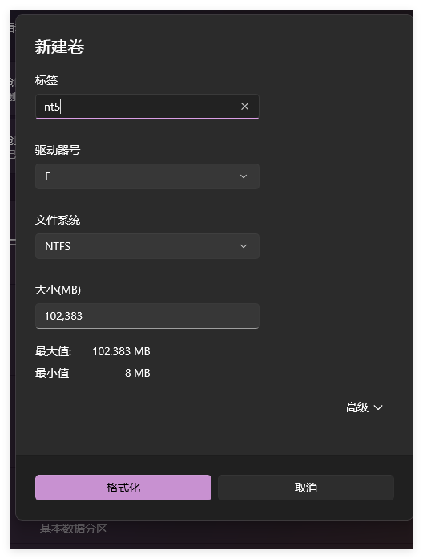
创建好分区之后将源代码复制到该虚拟盘符(必须为根盘符),并且取消其只读属性(包括子文件夹和文件)
（取消设置后，关闭/重新打开文件夹属性，可能会看到只读设置再次生效，这没关系，只要您取消设置一次，构建过程应该就不会有问题）
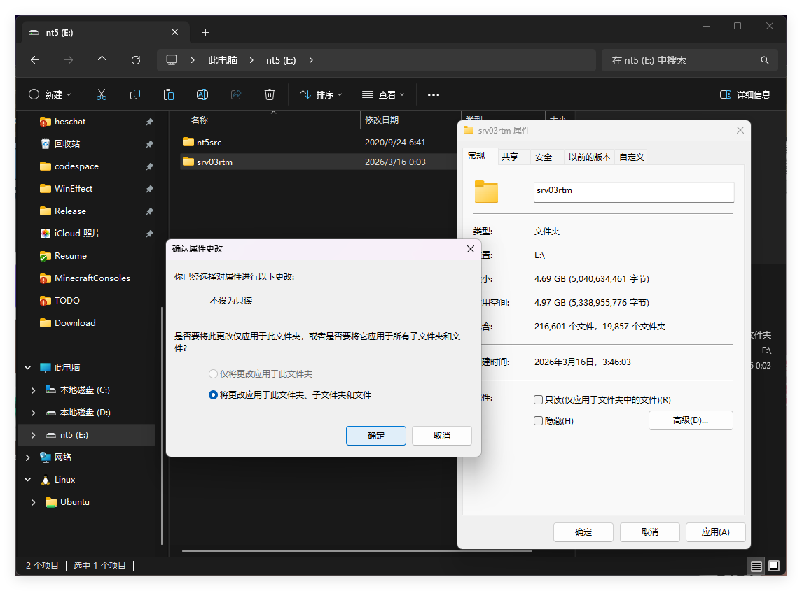
将 win2003_prepatched_v10a.zip 解压到您的源代码目录，并覆盖现有文件。
使用命令提示符运行


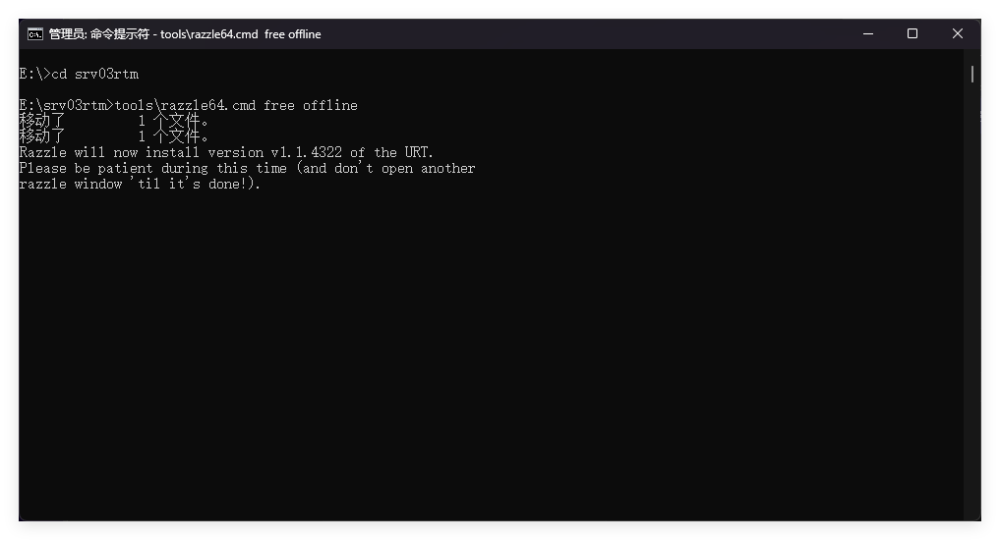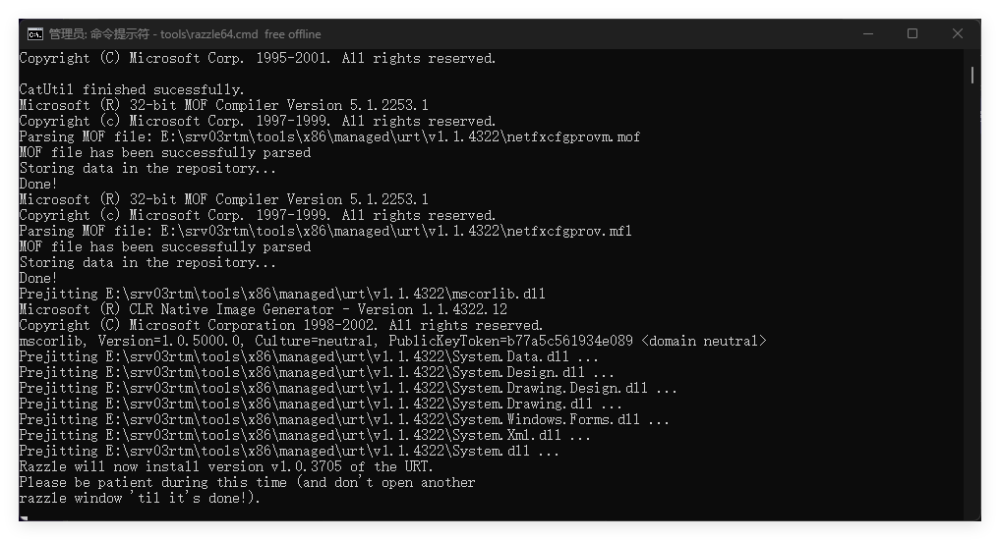
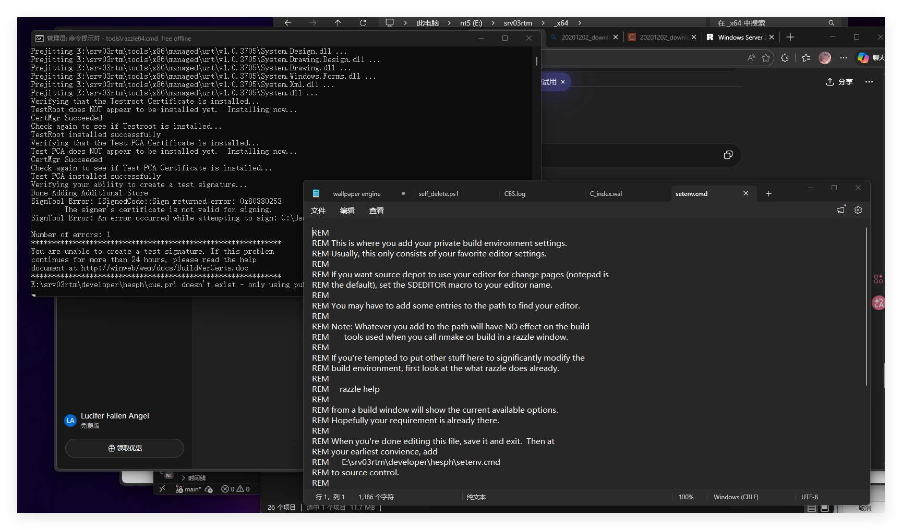此时出现了记事本必须要手动进行关闭,否则第一次初始化不会进行

第一次在该源代码副本中运行 razzle 时，它​​需要初始化一些东西，请稍等几分钟，过一会儿会出现一个记事本窗口 - 请务必关闭此窗口，以便继续初始化。
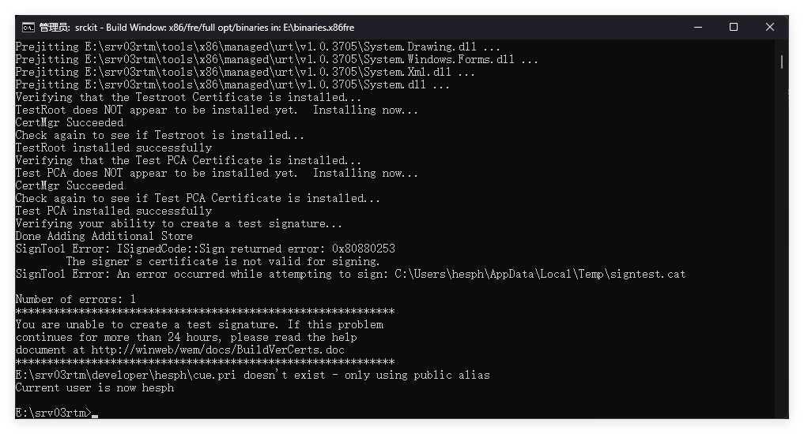
**重要提示：** Razzle 初始化完成后，运行 `tools\prebuild.cmd` 以完成构建环境的准备工作（只需在此目录下首次初始化 Razzle 后运行一次）。
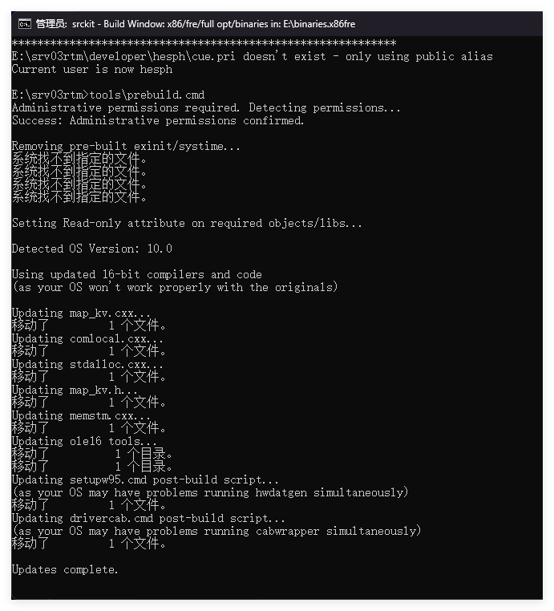
使用`build /cZP -M 4` 进行编译
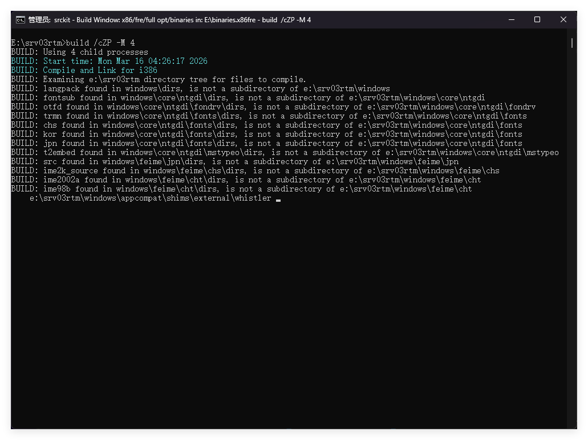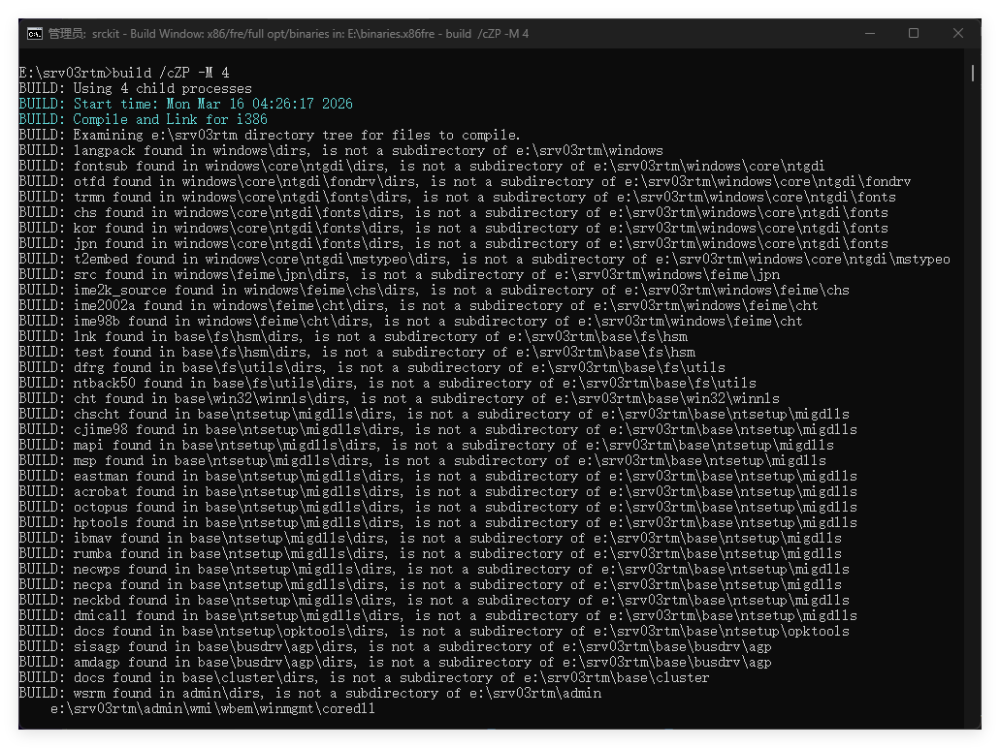

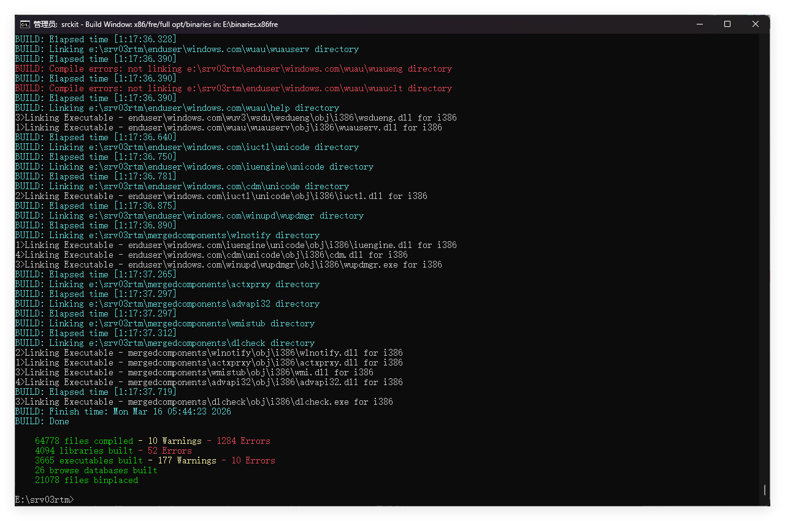

tools\postbuild.cmd
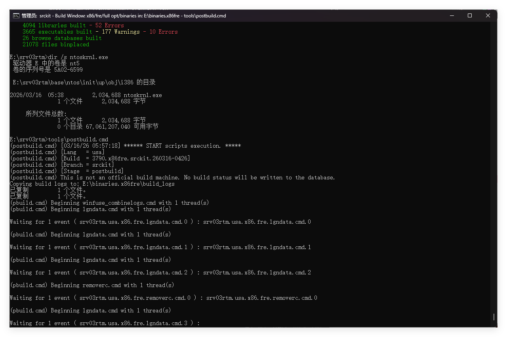
然后创建iso文件即可

参考链接: [Windows Server 2003 (NT 5.2.3790.0) 构建指南 --- Windows Server 2003 (NT 5.2.3790.0) build guide](https://rentry.co/build-win2k3)